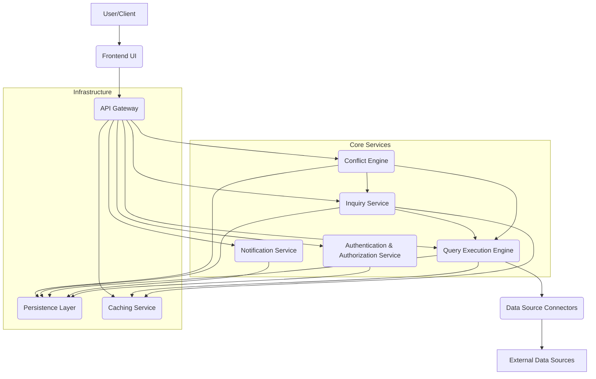
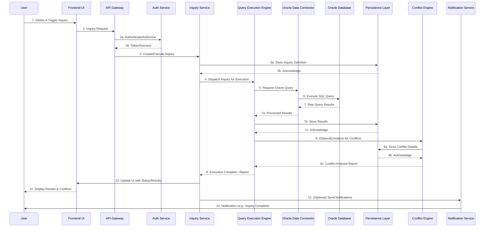

# Inquiry Foundation Application Architecture

The Inquiry Foundation is a robust platform designed to facilitate complex data inquiries, analysis, and conflict resolution across various data sources. This document provides a high-level overview of its core architectural components, illustrating how they interact to deliver a seamless and powerful user experience.

## 1. System Components Overview

The Inquiry Foundation is built upon a modular, microservices-oriented architecture, promoting scalability, resilience, and maintainability. Key components include:

*   **Frontend (UI):** The user interface, typically a web application, through which users interact with the system, define inquiries, view results, and manage conflicts.
*   **API Gateway:** The single entry point for all client requests, handling routing, authentication, and rate limiting.
*   **Inquiry Service:** Manages the lifecycle of inquiries, from definition and validation to execution scheduling and result storage.
*   **Data Source Connectors:** A set of services responsible for connecting to and querying various external data sources (e.g., Oracle, PostgreSQL, MongoDB, REST APIs). Each connector abstracts the specifics of its data source.
*   **Query Execution Engine:** Orchestrates the execution of queries across multiple data sources, potentially involving parallel processing and data aggregation.
*   **Conflict Engine:** The core intelligence for identifying, analyzing, and resolving data discrepancies or business rule violations. It applies predefined or user-defined rules to data sets.
*   **Notification Service:** Handles alerts, status updates, and other communications to users or external systems.
*   **Persistence Layer:** Stores application state, inquiry definitions, user data, audit logs, and conflict resolution history (e.g., using a relational database like PostgreSQL or a NoSQL store).
*   **Caching Service:** Improves performance by storing frequently accessed data or query results.
*   **Authentication & Authorization Service:** Manages user identities, roles, and permissions across the entire platform.

### 1.1. High-Level Component Diagram

## 2. Data Flow: Executing an Oracle Query

This section illustrates the typical data flow when a user initiates an inquiry that involves querying an Oracle database.

1.  **User Initiates Inquiry:** The user defines and triggers an inquiry via the Frontend UI.
2.  **API Gateway & Authentication:** The request goes through the API Gateway, which authenticates and authorizes the user.
3.  **Inquiry Service:** The Inquiry Service receives the request, validates the inquiry definition, and schedules its execution. It stores the inquiry details in the Persistence Layer.
4.  **Query Execution Engine:** The Inquiry Service dispatches the inquiry to the Query Execution Engine. The engine determines the necessary data sources and prepares the queries.
5.  **Oracle Connector:** The Query Execution Engine identifies that an Oracle data source is required and delegates the query to the specific Oracle Data Source Connector.
6.  **External Oracle Database:** The Oracle Connector establishes a connection to the external Oracle database, executes the query, and retrieves the raw results.
7.  **Result Processing & Storage:** The Oracle Connector returns the results to the Query Execution Engine. The engine may perform initial processing (e.g., schema mapping, basic transformations) and then stores the raw or processed results in the Persistence Layer.
8.  **Conflict Engine (Optional):** If the inquiry involves conflict detection, the Query Execution Engine might pass the results to the Conflict Engine for analysis against predefined rules.
9.  **Frontend Display:** The Frontend UI retrieves the inquiry status and results (and any detected conflicts) from the Inquiry Service and Persistence Layer, displaying them to the user.
10. **Notifications (Optional):** The Notification Service might send alerts regarding inquiry completion or conflict detection.

### 2.1. Oracle Query Data Flow Diagram

## 3. The Conflict Engine: Philosophy and Principles

The Conflict Engine is a cornerstone of the Inquiry Foundation, designed to move beyond simple data retrieval to intelligent analysis and resolution of discrepancies. Its philosophy is rooted in:

### 3.1. Declarative Rule Definition
Users and administrators define conflicts using a declarative rule language. Instead of writing imperative code to detect issues, they describe *what* constitutes a conflict (e.g., "if `value_A` from `source_X` does not match `value_B` from `source_Y` for the same `ID`," or "if `inventory_count` drops below `reorder_threshold`"). This approach makes rules easier to understand, maintain, and audit.

### 3.2. Contextual Awareness
Conflicts are not just about mismatched values; they are about discrepancies within a specific business context. The Conflict Engine understands the relationships between data points, the entities they represent, and the business rules governing them. This allows for more intelligent conflict identification and prioritization.

### 3.3. Pluggable Resolution Strategies
Once a conflict is identified, the engine doesn't enforce a single resolution path. Instead, it supports pluggable resolution strategies. These can range from automatic reconciliation based on predefined heuristics (e.g., "always trust source X over source Y") to manual review workflows, or even triggering external processes. This flexibility ensures that resolution aligns with specific business policies.

### 3.4. Auditability and Traceability
Every conflict detected, every rule applied, and every resolution action taken is meticulously logged and auditable. This provides a complete historical record, crucial for compliance, debugging, and understanding the evolution of data integrity.

### 3.5. Idempotency and State Management
The Conflict Engine is designed to be idempotent where possible. Re-running conflict detection with the same rules and data should yield the same conflicts (unless the underlying data or rules have changed). It maintains state regarding identified conflicts, allowing users to track their lifecycle from detection to resolution.

### 3.6. Extensibility
The engine is built to be extensible, allowing for the integration of new data sources, new rule types, and new resolution mechanisms as business needs evolve. This is achieved through a well-defined API and a modular architecture.

### 3.7. Focus on Business Value
Ultimately, the Conflict Engine aims to provide actionable insights. It transforms raw data discrepancies into meaningful business problems that can be understood, prioritized, and resolved, thereby improving data quality, operational efficiency, and decision-making.