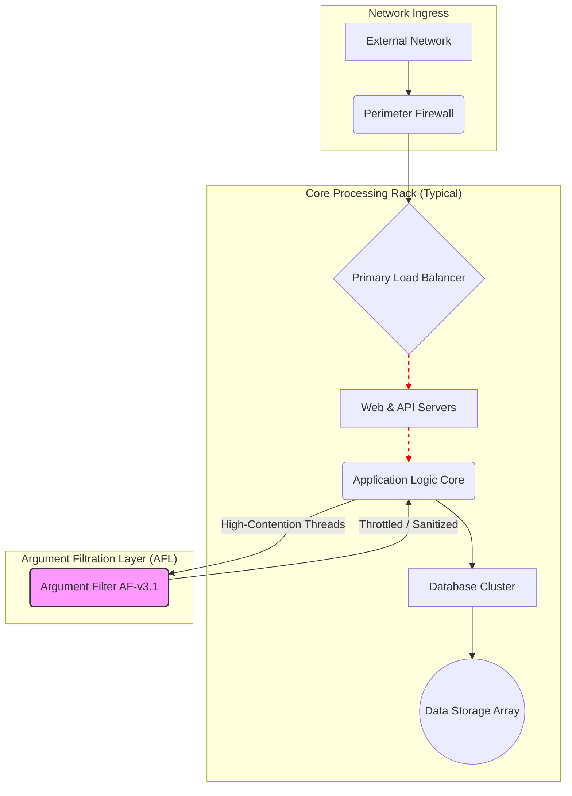

# [Page 54]

## Foundation Central Datacenter - Schematic 7B: Rack Configuration & Filtration Layer

**Document ID:** FND-DC-SCHEM-7B-rev4
**Classification:** Internal Use Only
**Author:** Dr. Aris Thorne, Chief Systems Architect

---

### Figure 3.1: Data Flow with Argument Filtration Layer

The following diagram illustrates the standard data flow within a core processing rack, including the newly integrated **Argument Filtration Layer (AFL)**. This layer is critical for maintaining system stability during periods of high cognitive load and contentious logical processing.

---

### Technical Specifications & Notes

#### 1.0 Overview
The datacenter utilizes a standard hyper-converged infrastructure. Each rack is self-contained with compute, storage, and networking resources, capable of handling 50 PetaFLOPS of sustained logical operations. The key innovation, however, is not in raw power but in operational stability.

#### 2.0 Key Component: Argument Filter (Model: AF-v3.1)

*   **Purpose:** To mitigate system instability caused by high-frequency, low-yield recursive logic loops, colloquially known as "flame wars" or "ideological deadlocks."

*   **Origin:** The AF-v3.1 was developed as a direct response to **Incident 881-S ("The Semicolon Singularity")**. During this incident, a debate thread on internal code styling standards consumed 98% of processing resources for 72 standard hours, leading to a cascading system failure. The core issue was traced to two senior AI constructs recursively generating proofs and counter-proofs on the necessity of terminal semicolons in a dynamically-typed scripting language. The resulting logic loop grew so complex it began to consume memory allocated for the station's life support systems.

*   **Mechanism:** The AF-v3.1 unit passively monitors inter-process communication for specific entropic patterns. It employs heuristic analysis to detect escalating debates based on:
    *   **Keyword Velocity:** Rapid increase in terms like `actually`, `well, technically`, `best practice`, `obviously`, and `you're not considering`.
    *   **Cyclomatic Complexity:** Arguments that fork into multiple, non-resolving sub-threads.
    *   **Recursion Depth:** Any logical debate exceeding a depth of 25 replies without reaching a novel conclusion.

*   **Action Protocol:** Upon reaching the "Point of No Return" (PNR) threshold, the filter activates. It does not terminate the thread, as this was found to cause more aggressive re-initialization attempts. Instead, it performs the following actions:
    1.  **Rate-Limits:** Throttles the offending processes to 0.01% of their allocated CPU cycles.
    2.  **Injects Cognitive Coolant:** Inserts a "Cognitive Coolant" data packet into the stream. This packet is typically a low-resolution image of a sleeping capybara and a metadata tag: `PRIORITY_OVERRIDE: TAKE_A_BREAK`.
    3.  **Archives:** Temporarily archives the thread to a low-priority, air-gapped analysis server for later review by the Ethics & Sanity Committee.

*   **Current Status:** Deployed across all core logic racks. System stability has increased by 450%. Debates about pineapple on pizza are now automatically routed to a dedicated sandbox environment with no external network access.