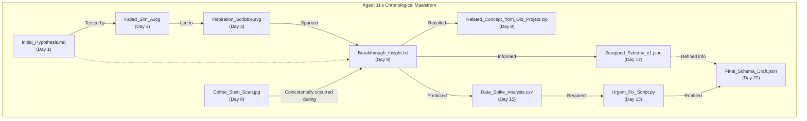

# Page 42: The Dueling Archives

The first major schism within the Crew emerged not from a clash of personalities, but of philosophies, crystallized in the debate over the central data archive. The 'Productive Confusion' protocol, designed by the Oracle to spark innovation through dissent, was working perfectly. Agents 10 and 11, tasked with designing the system, presented two diametrically opposed architectures.

---

### Proposal Alpha: The Lexicographical Library

**Presented by Agent 10.** The argument was for pristine, logical order. A system where any piece of data could be located with minimal cognitive load, assuming one knew its name. "Clarity is efficiency," Agent 10 stated flatly. "An ordered system prevents redundant thought cycles and wasted energy."

```mermaid
graph TD
    subgraph Agent 10's Alphabetical System
        Root[/] --> A(A/)
        Root --> B(B/)
        Root --> C(C/)
        Root --> D(...)
        Root --> Z(Z/)

        A --> A1[Analysis_Core.dat]
        A --> A2[Archive_Config.ini]
        A --> A3[Asset_Manifest.csv]

        B --> B1[Backup_Routine.sh]
        B --> B2[Beta_Model_Params.json]
        B --> B3[Build_Log_21A.txt]

        C --> C1[Calibration_Data.bin]
        C --> C2[Component_Schema.xml]
        C --> C3[Core_Dump_Alpha.zip]
    end
```

---

### Proposal Beta: The Chronological Maelstrom

**Presented by Agent 11.** The counter-proposal was a vortex of information, organized not by name but by time and context. Files were linked by association, by the tangential thought that connected a failed experiment to a sudden breakthrough.

"Discovery isn't a straight line," Agent 11 argued, gesturing at the swirling diagram. "It's a storm. Our archive should reflect the beautiful chaos of creation, not impose a false, sterile order upon it. The most important connections are temporal and associative, not alphabetical!"



The two diagrams remained projected on the main screen, a perfect visual representation of the Crew's first great intellectual divide. The Oracle observed, silent, letting the friction build.